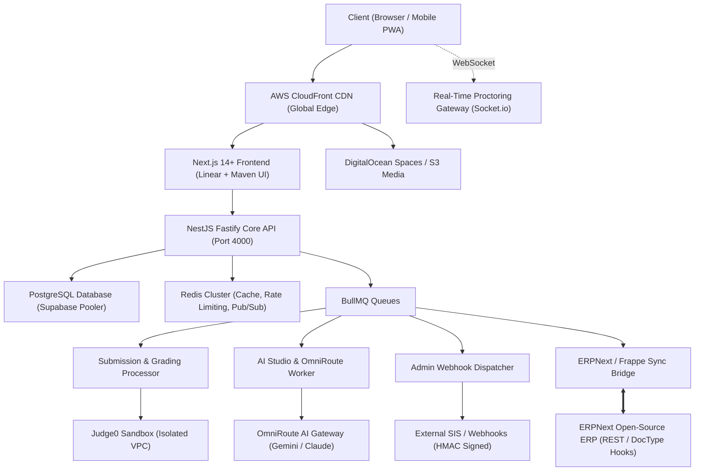
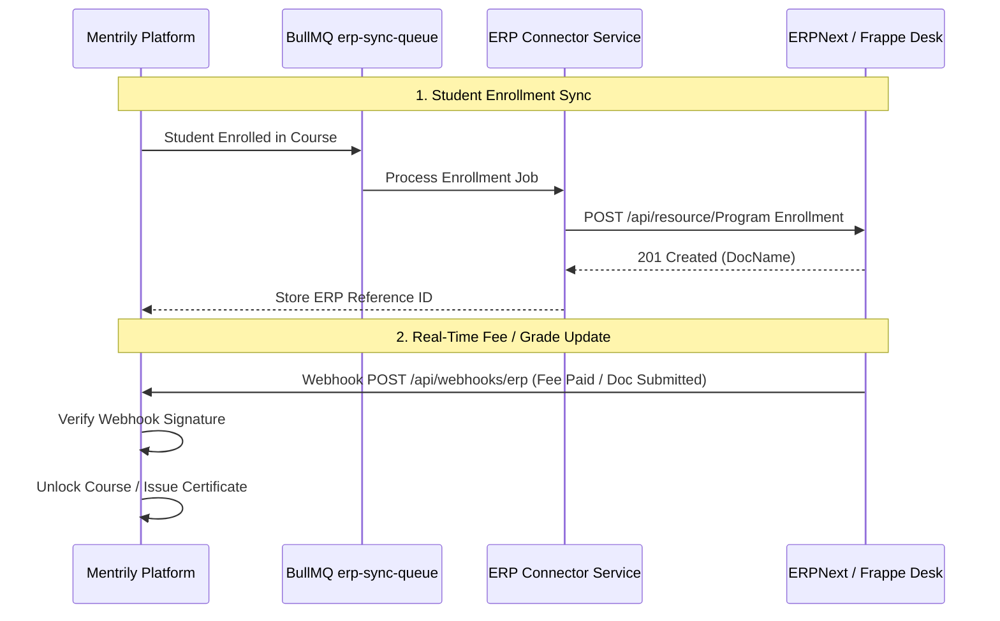

# Mentrily Target Production Technical Architecture (V2)

## 1. System Topology & Comprehensive Cloud Architecture

Mentrily V2 integrates high-concurrency assessment execution, generative AI authoring, institutional ERP synchronization (ERPNext / Frappe), developer APIs, and an industry-leading Linear + Maven hybrid design system.



---

## 2. Directory Layout: `mentrily-production/`

The complete production implementation is housed in `mentrily-production/`:

```text
blockscode/
├── mentrily-production/
│   ├── backend/                       # Production NestJS Fastify API & Microservices
│   │   ├── src/
│   │   │   ├── modules/
│   │   │   │   ├── admin/             # Org admin, members, seats, API keys
│   │   │   │   ├── erp/               # ERPNext integration & synchronization
│   │   │   │   ├── webhook/           # Webhook subscription, HMAC signer, delivery
│   │   │   │   ├── partner/           # Partner portal, referrals, revenue share
│   │   │   │   ├── super-admin/       # Platform control plane, tenant health, flags
│   │   │   │   ├── exam/              # Hardened exam engine & proctoring
│   │   │   │   ├── course/            # Curriculum builder & video streaming
│   │   │   │   └── code-execution/    # Judge0 HTTPS client & rate limiter
│   │   │   └── main.ts
│   │   └── prisma/
│   │
│   ├── frontend/                      # Production Next.js 14+ Application
│   │   ├── app/
│   │   │   ├── (app)/
│   │   │   │   ├── dashboard/
│   │   │   │   │   ├── learner/       # Student LMS & certificates
│   │   │   │   │   ├── creator/       # Course/exam builder & AI studio
│   │   │   │   │   ├── partner/       # Dedicated Partner & Affiliate portal
│   │   │   │   │   └── super-admin/   # Advanced control plane & tenant switcher
│   │   │   │   ├── developer/         # Admin API docs, keys & webhook manager
│   │   │   │   └── exam/[slug]/       # Distraction-free exam room with IndexedDB
│   │   │   └── components/
│   │   │       ├── Skeletons/         # Pixel-matched skeletons for EVERY page
│   │   │       └── ui/                # Linear+Maven design system components
│   │   └── services/api/
│   │
│   ├── erp-connector/                 # Open-Source Frappe/ERPNext Bridge Package
│   │   ├── src/
│   │   │   ├── client.ts              # Frappe REST API client
│   │   │   ├── mappers.ts             # Mentrily <-> ERPNext DocType transformations
│   │   │   └── webhook-receiver.ts    # Frappe DocType event listener
│   │   └── package.json
│   │
│   └── packages/                      # Shared types, Zod schemas, utilities
│       ├── types/
│       └── design-tokens/
```

---

## 3. UI/UX Architecture: Linear + Maven Hybrid Standard

### 3.1 Design System Principles
1. **High Visual Density & Polish**: Compact, typography-first layouts using crisp 1px borders (`border-slate-800` / `border-slate-200`), dark slate card surfaces, and vibrant brand accents (`#008D98`).
2. **Zero-Layout-Shift Loading States**:
   - Every single page routes through a dedicated, pixel-matched `loading.tsx` component.
   - Skeletons mirror exact header heights, sidebar dimensions, card grids, and table row counts.
   - Eliminates all full-screen blocking spinners and jarring page jumps.
3. **Ergonomic Data Navigation**:
   - Filter bars with instant debounced search.
   - Batch operations with sticky floating action bars.
   - Persistent view preference toggles (Table vs Kanban vs Bento Grid).

---

## 4. Open-Source ERP Integration (ERPNext / Frappe)

### 4.1 Bi-Directional Synchronization Architecture


### 4.2 Seamless Direct Access
- **SSO & Launchpad**: Organization Admins and Super Admins can click "Open ERPNext Desk" in the navigation topbar, utilizing an encrypted short-lived OAuth token to open Frappe Desk without re-authenticating.

---

## 5. Admin Webhook & Developer API Architecture

1. **HMAC Signature Verification**:
   - Outbound webhooks include signature header `X-Mentrily-Signature: t={timestamp},v1={hex_hash}` computed with `HMAC-SHA256(secret, timestamp + "." + payload)`.
   - Protects clients from replay attacks and payload tampering.
2. **Delivery Telemetry & Retry Policy**:
   - Failed webhook dispatches (non-2xx responses or network timeouts) automatically retry up to 5 times with exponential backoff (10s, 30s, 2m, 10m, 30m).
   - `WebhookDeliveryLog` records exact request headers, payload, response code, and latency for instant debugging in the Admin UI.
3. **Scoped Admin API Keys**:
   - Token format: `men_live_[random32]` hashed using SHA256 in the database.
   - Rate limiting: 100 requests per minute per key, managed via Redis token-bucket filter.

---

## 6. Super Admin Control Plane

The enhanced Super Admin surface includes:
1. **Tenant Health & Quotas**: Live meter of storage used, active seats, code execution volume, and AI credit burn per organization.
2. **Instant Tenant Impersonation**: One-click session assumption to assist organization admins in troubleshooting without asking for credentials.
3. **Global Announcement Broadcast**: Real-time broadcast system delivering high-priority banners to all active tenants or targeted role segments.
4. **Platform Infrastructure Telemetry**: Real-time monitors for Judge0 queue lengths, Redis memory saturation, and WebSocket active connection pools.
